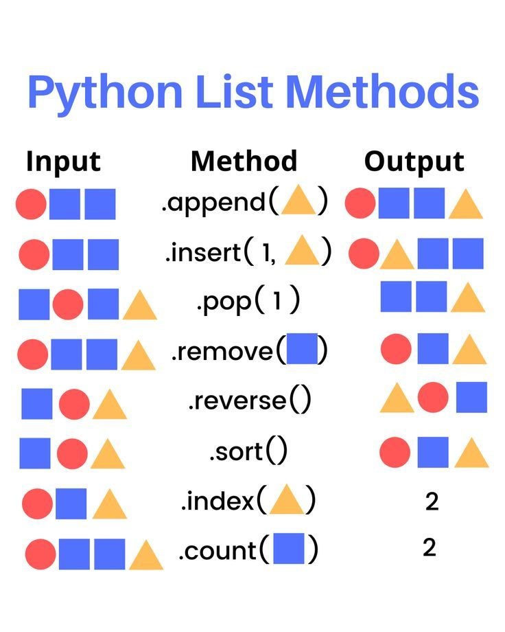

# Curso-fundamentos-Python
Ejercicios de curso práctico de platzi

##  ¿Por que utilizar Python? ##
1. Python siempre ocupa los primeros puestos de los lenguajes mas queridos. En el año 2021 en la encuesta realizada por "Developer Survey" ocupa el cuarto puesto.

2. Es fácil de aprender. Su curva de aprendizaje no es tan pronunciada.

3. Esta en el top 20 de los lenguajes de programación mejor pagos.

4. Puede ser utilizado en diferentes áreas, especialmente en Análisis de datos (51%) y desarrollo web (45%).

5. Tiene una gran demanda laboral en el mundo de la tecnología.

## Herrameintas utilizadas en el curso ##

Se utilizará "Replit" que permite realizar códigos desde el navegador 

## Algunas herramientas de la industria ##

1. **Visual Studio Code** que es un editos de código.

2. **Terminal y línea de comandos** en diversos sistemas operativos.

3. **Jupyter Notebooks** para data science.

4. **Git** para control de versiones.

5. Para entornos virtuales con **PIP**.

6. Para entornos integrados de desarrollo (IDE) como **PyCharm, Visual Studio o DataSpell**.


## Print () ##

Se utiliza para imprimir notas o resultados 

```python
print("Hola, mi nombre es Maria Antonia")
```
## Uso de las comillas triples y numeral ##

Se utilizan normalmente para dejar comentarios entre líneas

```python
# Dejar comentarios entre lineas
""" Dejar comentarios un poco mas 
extensos """
```
## Variables de programación ## 

Todas las variables están nombradas para ser reconocidas durante la ejecución del código 

```python
my name= "Maria"
print("Mi nombre es",my_name)
```

## Input

Se utiliza para obtener una entrada de texto del usuario a través de la consola

```python
my_name= input("¿Cuál es tu nombre?")
print("Mi nombre es", my name)
```
# Tipos de datos

## Tipos de datos primitivos

**Strings:** Cadena de caracteres (texto)

```python
my name="Maria"
print("myname =>", my name)

#Para diferenciar la variable
print(type(my_name))
```

**Integers:** Números Enteros

```python
my_age=12
print("my age", my_age)
print(tupe(my_age))
```

**Boolean:** Boolenaos (Verdadero o Falso)

```python
is_single = True
print("is_single => ", is_single)
print(type(is_single))
```

**Floats:** Números de punto flotante (decimales)

## Tipos de dato adicionales

**- Datos en texto:** str

**- Datos numéricos:** int, float, complex

**- Datos en secuencia:** list, tuple, range

**- Datos de mapeo:** dict

**- Set Types:** set, frozenset

**- Datos booleanos:** bool

**- Datos binarios:** bytes, bytearray, memoryview

# Strings

*Cadena de caracteres (texto)*

```python
name = "Maria"
last_name= "Ospina"
print(name)
print(last_name)

full_name = name + " "+ last_name
print(full_name)

quote = "I' am Maria"
print(quote)

#format
template = "Hola, mi nombre es " + name + " y mi apellido es " + last_name
print("v1",template)

template = "Hola, mi nombre es {} y mi apellido es {}". format(name,last_name)
print("v2",template)

template= f"Hola, mi nombre es {name} y mi apellido es {last_name}"
print("v3", template)
```
# Numbers


*Las variables tipo numero pueden ser enteras o flotantes y siempre se declaran sin estar encerradas entre comillas ya que de lo contrario serian tipo string.*

## Int
```python
lives = 3
print(type(lives))
```

## Float 
```python
temperature = 12.12
print(type(temperature))
```
*Podemos realizar operaciones con la misma variable y para esto tenemos 2 formas de hacerlo, la cual la segunda es la forma simplificada donde se utilizan operadores de asignacion*

```python
lives = lives - 1
lives - =1
print(lives)

lives + =5
print(lives)
```

*Python nos muestra en notación científica números cuyo valor es muy grande o muy pequeño*

```python
#Valores extremadamente grandes 
number = 45000000000000000000000000000
print(number)

#Valores extremadamente pequeños
number_b= 0.00000000001
print(number_b)
```
## Booleans

*Tipo de dato que solo tiene 2 estados: True o False, y nos permiten saber si un objeto tiene o no un estado*

```python
is_single= True
print(type(is_single))
is_singlesigle= False
print(is_single)

#Para invertir el valor
print(not True)
print(not False)

is_single= not is_single
print(is_single)
```

# Transformación de datos

Pasar un dato hacia un string para utilizarlo en la función print()

```python
age = input("Escribe tu edad")
print(type(age))
age = int(age)
age += 10
print(f"Tu edad en 10 años será {age}")
```

# Operadores aritméticos 

Nos permiten reliazar cálculos tales como suma (+), resta (-), multuplicación (*), división (/), residuo (%), división con valor entero (//) y exponenciación (**) 

``` python 
print (10 + 20)
print (10 - 5)
print (10 * 2)
print (10/2)

#Contanenación
print( "Hola" + "mundo")

#Repetición de cadena
print("Hola" *3)

#Operador de módulo - residuo 
print (10 % 2)

#Operador de módulo entero 
print(10//3)

#Operador exponencial 
print(2**3)
print(2**3 + 3 - 7 /1)
```

*Se debe de tener en cuenta la prioridad de la ecuación*


# Operadores de comparación 

Comparan dos expresiones y devuelven un valor Boolean que representa la relación de sus valores


``` python 
# >
print(7>3)
print (3>7)

# <
print (5>6)
print(6<5)

# >=
print(2 >= 1)
print(2 >= 3)
print(2 >= 2)

age = 18
print(age >= 18)

# ==
print (6==6)
print("Apple" == "Apple")
print("1"==1) #Son diferentes

# != Valor diferente
print(6 != 10)
```

# Comparación de números flotantes 

``` python 
x = 3.3
y= 1.1 + 2.2
print(x)
print(y)
print(x == y) #No son iguales

#Con strings 
y_string = format(y, ".2g")
print("str =", y_string)
print( y_str == str(x))

#Forma matemática
print("*" *10)
print(y,x)
tolerance = 0.0001
print(abs(x - y) < tolerance)
```

# Operadores lógicos_ and y or 

``` python
#And
print("True and True =>", True and True)
print("True and False =>", True and False)
print("False and True =>", False and True)
print("False and False =>", False and False)

print(10 > 5 and 5 < 10)
print(10 > 5 and 5 > 10)

stock = input("Ingrese el numero de stock =")
stock = int(stock)
print(stock >= 100 and stock <= 1000)

#Or        
print("True or True =>", True or True)
print("True or False =>", True or False)
print("False or True =>", False or True)
print("False or False =>", False or False)

role= input("Digita el rol =")
print(role == "Admin" or role == "Seller")
```
# Operador lógico_ not

``` python
print( not True)
print( not False)

# NOT AND 
print("not True and True =>", not (True and True))
print("not True and False =>", not (True and False))
print("not False and True =>", not (False and True))
print("not False and False =>", not (False and False))

stock = input("Ingrese el numero de stock =")
stock = int(stock)
print(not(stock >= 100 and stock <= 1000))
```

# Condicionales

Sentencias que te permiten condicionar la decisión entre la elección de una opción y otra.


``` python
if True:
  print("Dbería ejecutarse")

if False:
  print("No se ejecuta")

# Mascotas
pet = input("Cuál es tu mascota favorrita?")
if pet == "perro":
  print("Genial tienes buen gusto")

elif pet == "gato":  #Combinación 
  print("Espero tengas suerte")

elif pet == "pez":
  print("Eres lo máximo")
else:
  print("No tienes mascota")

#Stock
stock = int(input("Digita el stock => "))
if stock >= 100 and stock <= 1000:
  print("El stock es correcto")
else:
  print("El stock es incorrecto")
```

# Proyecto piedra, papel o tijera con condicionales


``` python
user_option= input("Piedra, papel o tijera => ")
user_option= user_option.lower()
computer_option = "papel"

if user_option == computer_option:
  print("Empate")
elif user_option == "piedra":
  if computer_option == "tijera":
    print("Piedra gana a tijera")
    print("User gano")
  else:
    print("Papel gana a piedra")
    print("Computer gano")
elif user_option == "papel":
  if computer_option == "piedra":
    print("Papel gana piedra")
    print("User gano")
  else:
    print("Tijera gana a papel")
    print("Computer gana")
elif user_option == "tijera":
  if computer_option == "papel":
    print("Tijera gana a papel")
    print("User gano")
  else:
    print("Piedra gana a tijera")
    print("Computer gano")
```

# Métodos de los Strings

## Si la palabra se encuentra en el texto

``` python
text = "Ella sabe programar en Python"
print("JavaScript" in text)
print("Python" in text)

if "Python" in text:
  print("Elegiste bien!")
else:
  print("Tambien elegiste bien")
```

## Tamaño del texto 

``` python
#TAMAÑO DE TEXTO 
size = len("text")
print(size)
```

## Pasar a mayúsculas

``` python
#Mayusculas
print(text)
print(text.upper())
```
## Pasar a minúsculas

``` python
#Minusculas
print(text.lower())
```

## Número de apariciones de una letra

``` python
#Número de apariciones de una letra
print(text.count("a"))
```

## Pasar lo que esta en min a may y de may a min

``` python
#Pasar lo que esta en min a may y de may a min
print(text.swapcase())
```

## Si el texto inicia con ()

``` python
#El texto inicia con...
print(text.startswith("Ella"))
```

## Si el texto finaliza con ()

``` python
#El texto finaliza con...
print(text.endswith("Python"))
```

## Reemplazar una palabra

``` python
#Reemplazar
print(text.replace("Python", "Go"))
```

## Poner el primer carácter en mayúscula

``` python
#Poner el primer caracter en mayuscula
text_2 = "este es un titulo"
print(text_2)
print(text_2.capitalize())
```

## Poner el incio de cada palabra en mayuscula

``` python
#Incio de cada palabra en mayuscula
print(text_2.title())
```

## Saber si es un dígito 

``` python
#Saber si es un digito 
print(text_2.isdigit())
```

# Indexing y slicing

## Indexing 

*Nos permite obtener el índice o posición de la primera aparición de un elemento dentro de una lista*

``` python
text= "Ella sabe Python"
#Dar la posición []
print(text[1])
```
* Posición de último carácter del texto

``` python
#Último caracter del texto
size = len(text)
print("size => ", size)
print(text[size - 1])

print(text[-1])
```

## Slicing 

*Operación por medio de la cual se extraen elementos de una secuencia, tal como una lista o una cadena de caracteres*

``` python
#Slicing - dar una cadena 
print(text[0:5])
print(text[:10]) #[0:10]
```

* Desde una posición hasta el final 

``` python
#Desde una posición hasta el final 
print(text[5:])
print(text[:])
```
* Número de saltos 

``` python
# Número de saltos
print(text[10:16:2])
print(text[::2])
```

# Listas 

``` python
numbers = [1, 2, 3, 4]
print(numbers)
print(type(numbers))

tasks= ["make a dishes", "Play"]
print(tasks)
```
* Extraer cadena de texto en lista

``` python
# Extraer cadena de texto en lista
print(numbers[0])
print(task[0])
```

* Actualización según posición []

``` python
#Actualización según posición []
tasks[0]= "Watch platzi course"
print(tasks)
```

* Seleccionar parte de los elementos


``` python
#Seleccionar parte de los elementos
print(numbers[:3])
print(3 in numbers)
```

## Métodos de listas 


``` python
#CRUD create, read, Update and Delete
numbers = [1, 2, 3, 4, 5]
print(numbers[1])
print[-1]= 10
print(numbers)
```
* Añadir valores al final de la lista

``` python
#Añadir valores al final de la lista
numbers.append(700)
print(numbers)
```
* Añadir valores en cierta posición de la lista

``` python
#Añadir valores en cierta posición de la lista
numbers.insert(0, "hola")
print(numbers)

numbers.insert(3, "change")
print(numbers)
```

* Unión de listas
``` python
#Union de listas
task=["todo 1", "todo 2","todo 3"]
new_list= numbers + task 
print(new_list)
```

* Saber posición de elemento 
``` python
#Saber posición de elemento 
index = new_list.index("Todo 2")
new_list[index]= "Todo changed"
print(new_list)
```

* Eliminación
``` python
#Eliminación
new_list.remove("Todo 1")
print(new_list)

new_list.pop(0)
print(new_list)
```

* Eliminación último elemento 
``` python
#Eliminación último elemento 
new_list.pop()
print(new_list)
```

* Cambiar de posición
``` python
#Cambiar de posición 
new_list.reverse()
print(new_list)
```

* Ordenar
``` python
#Ordenar
numbers_a = [1,4,6,3]
numbers_a.sort()
print(numbers_a)

strings = ["re", "ab", "ed"]
strings.sort()
print(strings)
```

# Tuplas 

*Estructura de datos inmutables que contiene una secuencia ordenada de elementos*

``` python
#Tuplas - solo de lectura
#CRUD - no se puede modificar 
numbers= (1,2,3,5)
strings = ("nico", "zule", "santi")
print(numbers)
print(strings)

print(type(numbers))
print(type(strings))
```

* Buscar elementos
``` python
#Buscar elementos
print("0 =>", numbers[0])
print("-1 =>", numbers[-1])
```

* Buscar posición
``` python
#Buscar posición 
print(strings)
print(strings.index("zule"))
```

* Conteo en tupla
``` python
#Conteo en tupla
print(strings.count("nico"))
```

* Transformación de tupla a lista
``` python
#Transformación de tupla a lista
my_list = list(strings)
print(my_list)
print(type(my_list))

#Se puede comenzar a modificar
my_list[1]= "juli"
print(my_list)
```

* Transformación de lista a tupla
``` python
#Trasnformación de lista a tupla
my_tuple= tuple(my_list)
print(my_tuple)
```
# Proyecto piedra, papel o tijera con tuplas


``` python
import random

options= ("piedra","papel","tijera")

user_option= input("Piedra, papel o tijera => ")
user_option= user_option.lower()

if not user_option in options:
  print("Esa opción no es valida")

computer_option = random.choice(options)

print("User option =>", user_option)
print("Computer option =>", computer_option)

if user_option == computer_option:
  print("Empate")
elif user_option == "piedra":
  if computer_option == "tijera":
    print("Piedra gana a tijera")
    print("User gano")
  else:
    print("Papel gana a piedra")
    print("Computer gano")
elif user_option == "papel":
  if computer_option == "piedra":
    print("Papel gana piedra")
    print("User gano")
  else:
    print("Tijera gana a papel")
    print("Computer gana")
elif user_option == "tijera":
  if computer_option == "papel":
    print("Tijera gana a papel")
    print("User gano")
  else:
    print("Piedra gana a tijera")
    print("Computer gano")
```

# Diccionarios

``` python
my_dict= {}
print(type(my_dict))

my_dict= {
  "avion": "bla bla bla"
  "name": 'Maria'
  "last name": "Molina"
  "age": 87
}
print(my_dict)
```

* Número de elementos
``` python
#Número de elementos
print(len(my_dict))
```

* Leer ese diccionario
``` python
#Leer ese diccionario
print(my_dict["age"])
print(my_dict["last name"])
print(my_dict.get("age")) #si no existe - dira none (nada definido)
```

* Palabra se encuentra en diccionario 
``` python
#Palabra se encuentra en diccionario 
print("avion" in my_dict)
```

* Actualización 

``` python
person = {
  "name": "Maria"
  "last_name": "Ospina"
  "langs": ["python", "javascript"]
  "age": 99
}

print(person)

#Actualización 
person["name"]= "Santi"
person["age"]-= 50
person["langs"].append("rust")
print(person)
```

* Eliminación 

``` python
#Eliminación 
del person["last_name"]
person.pop("age")
print(perso
``` 

* Orden

``` python
#Orden 
print("items")
print(person.items())

print("keys")
print(person.keys())

print("values")
print(person.values())
```
# Ciclos

## Loops: While

``` python
counter = 0

while counter < 10:
  counter += 1
  print(counter)
```

* Break
``` python  
#Break - rompiendo de forma forzadaa
counter= 0
while counter < 20:
  counter += 1
  if counter == 15
    break 
  print(counter)
```

* Continue 
``` python
#Continue (del 15-20) 
counter= 0
while counter < 20:
  counter += 1
  if counter < 15
    continue   
  print(counter)
```

## Loops: For

``` python
for element in range(1,21): 
  print(element)
```

* Lista

``` python
#Lista 
my_list= [23,45,67,89,43]
for element in my_list:
  print(element)
```

* Tupla

``` python
#Tupla
my_tuple= ["Nico","juli","santi"]
for element in my_tuple:
  print(element)
```

* Diccionario 

``` python
#Diccionario 
product = {
  "name": "camisa"
  "price": 100
  "stock": 89
}

for element in product:
  print(key, "=>", product[key]

for key, value in product.items():
  print(key,"=>", values)
```

* Lista con diccionarios dentro 

``` python
#Lista con diccionarios dentro 
people = [
  {
    "name": "nico"
    "age": 34
  },
  {
    "name": "zule"
    "age": 45
  },
  {
    "name": "santi"
    "age": 4  
  }
]
```

* Visualización de datos

``` python
#Visualización de datos
for person in people:
  print("name =>", person["name"])
```

## Ciclos anidados

``` python
matriz = [
  [1,2,3],
  [4,5,6],
  [7,8,9]
]
print(matrriz[0][1])

for row in matriz:
  print(element)
  for column in row:
    print(column)
```

# Proyecto piedra, papel o tijera con ciclos


``` python
import random 

options = ('piedra', 'papel', 'tijera')
rounds = 1
computer_wins = 0 
user_wins = 0

print("""
      [ 🤖 Bienvenido al juego Piedra, Papel o tijera 🙋]
                  >>> Ingresa una opción <<<
      """)

while True:
    print('***' * 10)
    print('Round ', rounds)
    print('***' * 10)
    
    print(f'''
🤖 Computer wins: {computer_wins}
🙋 User wins: {user_wins}
          ''')
    
    user_option = input('>>> Piedra, papel o tijera => ').lower()
    rounds += 1
    
    if not user_option in options:
        print('Esa opción no es valida')
        
    computer_option = random.choice(options)

    print('User option => ', user_option)
    print('Computer option => ', computer_option)

    if user_option == computer_option:
        print('Empate!\n')
    elif user_option == 'piedra':
        if computer_option == 'tijera':
            print('🪨 Piedra gana a tijera ✂️')
            print('¡User gana!\n')
            user_wins += 1
        else:
            print('📄 Papel gana a piedra 🪨')
            print('¡Computer gana!\n')
            computer_wins += 1
    elif user_option == 'papel':
        if computer_option == 'piedra':
            print('📄 Papel gana a piedra 🪨')
            print('¡User gana!\n')
            user_wins += 1
        else:
            print('✂️ Tijera gana a papel 📄')
            print('¡Computer gana!\n')
            computer_wins += 1
    elif user_option == 'tijera':
        if computer_option == 'papel':
            print('✂️ Tijera gana a papel 📄')
            print('¡User gana!\n')
            user_wins += 1
        else:
            print('🪨 Piedra gana a tijera ✂️')
            print('¡Computer gana!\n')
            computer_wins += 1
    
    if computer_wins == 3:
        print('🎖️ El ganador es Computer 🎖️')
        break
    
    if user_wins == 3:
        print('🎖️ El ganador es User 🎖️')
        break
```
